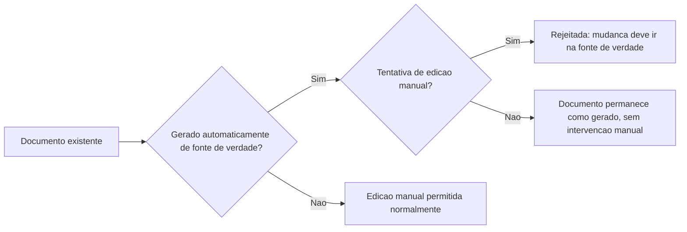

# Fluxogramas

O nó `D` protege contra o cenário mais comum de perda silenciosa de trabalho em documentação: uma
edição manual feita diretamente num arquivo gerado, que parece funcionar até a próxima geração
sobrescrever a mudança sem aviso — a rejeição explícita, no momento da tentativa, é o que evita
essa perda.

## Por que gerado e manual nunca coexistem no mesmo documento

`Documento` não modela um estado intermediário de "parcialmente gerado, parcialmente manual" —
essa ambiguidade seria exatamente o cenário mais difícil de manter corretamente: alguém editando
manualmente parte de um arquivo que também é regenerado automaticamente eventualmente perde a
edição sem entender por quê, porque não há como a ferramenta de geração distinguir a parte
manual da parte que deveria substituir.

## Relação com W3

Versionamento junto do código (W3) é pré-requisito implícito para este fluxo fazer sentido — um
documento gerado automaticamente só tem uma fonte de verdade rastreável se essa fonte também está
sob controle de versão; caso contrário, "fonte de verdade" seria apenas um nome sem garantia real
de que o conteúdo gerado corresponde a algo estável e auditável.

Essa dependência implícita nunca é verificada estruturalmente por este exemplo mínimo, mas vale reconhecê-la explicitamente como pré-condição de sentido.

Uma futura extensão deste modelo poderia verificar isso automaticamente, mas o exemplo mínimo atual deixa essa responsabilidade para o processo externo que gerencia a fonte de verdade em si.