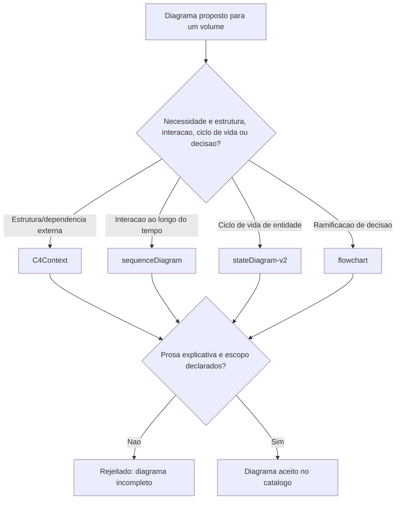

# Fluxogramas

A escolha de tipo (nó `B`) acontece antes de qualquer desenho — a pergunta "o que preciso
mostrar" decide o tipo, nunca o contrário. Isso é a materialização de X5: nenhum caminho do
fluxo permite decidir o tipo primeiro e forçar o conteúdo a caber nele depois.

## Por que prosa e escopo são exigidos juntos, não separadamente

O nó `G` verifica os dois ao mesmo tempo — um diagrama com prosa mas sem escopo declarado ainda
corre o risco de ser lido como mais completo do que é; um diagrama com escopo declarado mas sem
prosa ainda deixa a estrutura visual sem explicação do porquê. As duas exigências juntas é o que
torna um diagrama confiável, nenhuma sozinha é suficiente.

## Relação com o catálogo de tipos obrigatórios por volume

O contrato do acervo (`00-INTRODUCAO/contrato.json`) já declara quais tipos de diagrama são
obrigatórios para cada tipo de volume — ENGINE exige os três, ARQUITETURA exige dois,
GOVERNANCA e PROCESSO exigem flowchart. Este catálogo não substitui essa exigência estrutural;
formaliza em prosa o propósito de cada tipo que a exigência estrutural já impõe silenciosamente.

Reconhecer essa relação evita a confusão de tratar o catálogo como uma segunda fonte de verdade paralela ao contrato, quando na verdade ele é complementar e explicativo.

Essa clareza de papel também facilita revisar os dois documentos juntos quando o contrato muda, sem risco de um ficar defasado em relação ao outro por muito tempo.