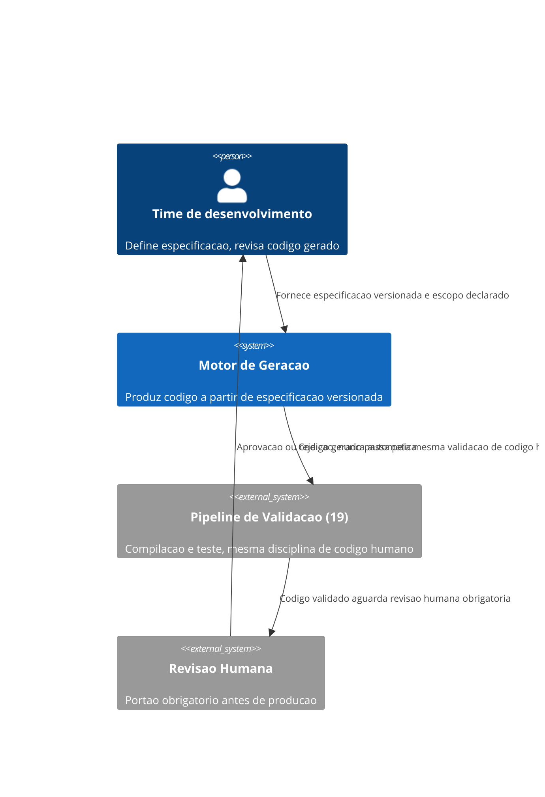
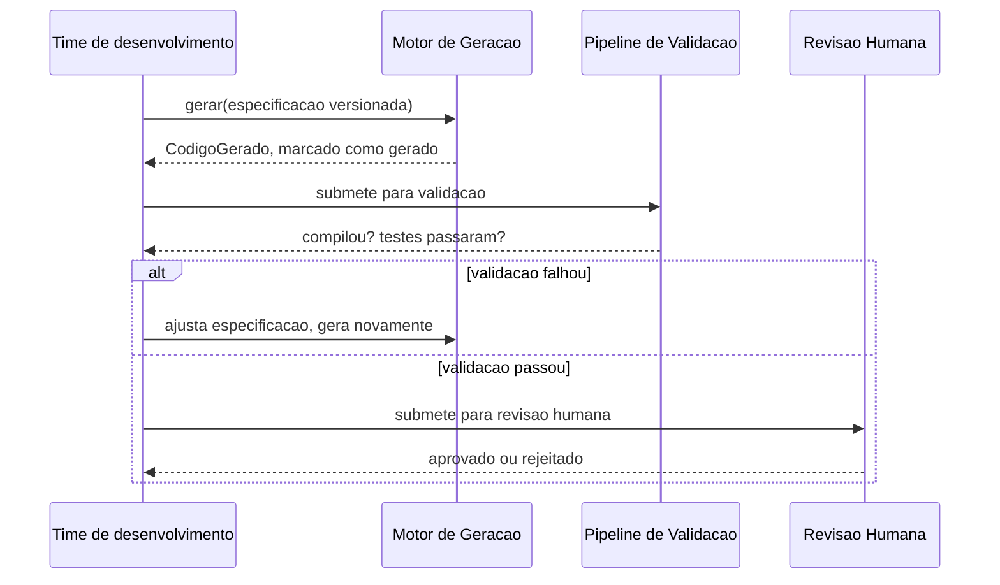

# Diagramas

Nenhuma seta liga `Motor de Geracao` diretamente a produção — todo código gerado passa por
`Pipeline de Validacao` e por `Revisão Humana` antes de qualquer consequência real, o mesmo
caminho que código escrito manualmente atravessaria.

O ramo de falha de validação nunca leva a editar o código gerado diretamente — leva de volta ao
gerador, com a especificação ajustada, preservando a garantia de que o código de saída sempre
reflete sua especificação de origem.

O `C4Context` deixa claro que o `Motor de Geração` nunca fala diretamente com produção — toda
saída atravessa primeiro o `Pipeline de Validação` e depois a `Revisão Humana`, o mesmo caminho
que qualquer código escrito manualmente também atravessaria antes de qualquer consequência real
acontecer no sistema em produção.

O sequenceDiagram, por sua vez, mostra o ciclo completo de uma tentativa de geração até a decisão final, incluindo o caminho de retorno quando a validação falha.

Isso torna explícito, num único diagrama, o momento exato em que a especificação original é
revisitada em vez de o código de saída ser remendado diretamente, reforçando visualmente a
mesma disciplina que a prosa da seção anterior já descreve em detalhe textual completo, dando ao
leitor duas formas independentes de internalizar exatamente a mesma garantia central.