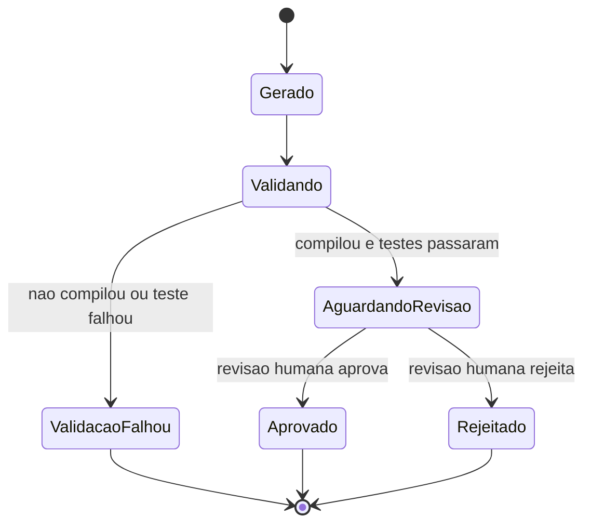

# Fluxogramas

Nenhum estado alcança `Aprovado` sem passar por `AguardandoRevisao` — não existe transição direta
de `Validando` para `Aprovado` que pule a revisão humana, mesmo quando a validação automatizada
passou completamente. Essa ausência de atalho é a materialização de Y4.

## Por que falha de validação não tenta reparo automático

O estado `ValidacaoFalhou` sempre termina o ciclo (`[*]`), nunca tenta corrigir o código gerado
automaticamente e revalidar sozinho — um reparo automático sobre código já gerado incorretamente
tende a produzir uma segunda camada de geração sem visibilidade, tornando mais difícil entender
depois o que de fato produziu o código final. Corrigir significa voltar à especificação, gerar de
novo, e validar de novo — nunca remendar a saída.

O `stateDiagram-v2` mostra que o único caminho para `Aprovado` passa obrigatoriamente por
`AguardandoRevisao` — não existe atalho de `Validando` direto para `Aprovado`, e essa ausência
estrutural de atalho é o que torna Y4 uma garantia, não apenas uma recomendação de processo que
alguém poderia esquecer de seguir sob pressão de prazo apertado.

Esse mesmo princípio de ausência estrutural de atalho já apareceu em outros volumes deste acervo, sempre com o mesmo objetivo de tornar uma garantia à prova de pressa.

Reconhecer esse padrão compartilhado ajuda a aplicar a mesma disciplina rapidamente sempre que um novo tipo de portão obrigatório precisar ser modelado no futuro.