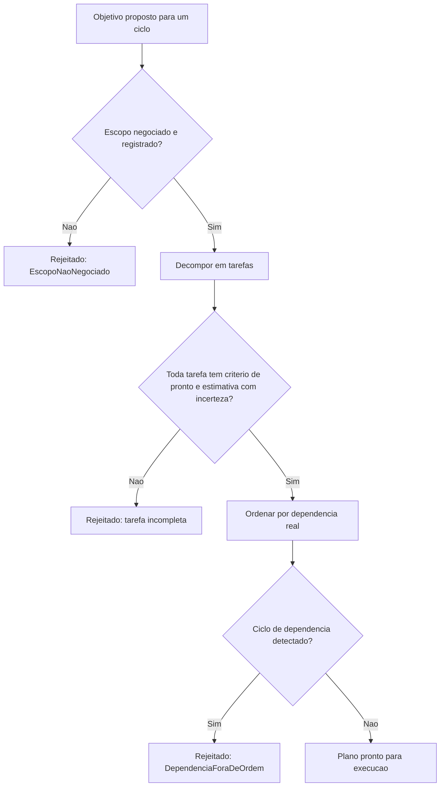

# Diagramas

O portão de escopo (`B`) acontece antes de qualquer decomposição em tarefa — não faz sentido
decompor um objetivo cujo escopo ainda não foi negociado, porque a decomposição em si dependeria
de limites que ainda não existem formalmente.

A detecção de ciclo de dependência (`H`) é o que impede um plano logicamente impossível de
avançar para execução — duas tarefas que dependem uma da outra circularmente nunca poderiam ser
ordenadas de forma válida, e é melhor descobrir isso na fase de planejamento do que no meio da
execução.

O fluxo inteiro é sequencial e sem atalho — nenhum caminho permite pular direto de "objetivo
proposto" para "plano pronto para execução" sem passar pela negociação de escopo, pela
verificação de completude de cada tarefa, e pela detecção de ciclo de dependência impossível.

Cada portão intermediário existe justamente para capturar, o mais cedo possível, um problema que seria muito mais caro descobrir apenas durante a execução real do trabalho planejado.

Um problema encontrado nesta fase custa apenas o tempo de replanejar; o mesmo problema
encontrado no meio da execução custa o tempo já investido até aquele ponto, além do esforço
adicional de reorganizar tudo o que já foi feito em torno do erro descoberto tarde demais.