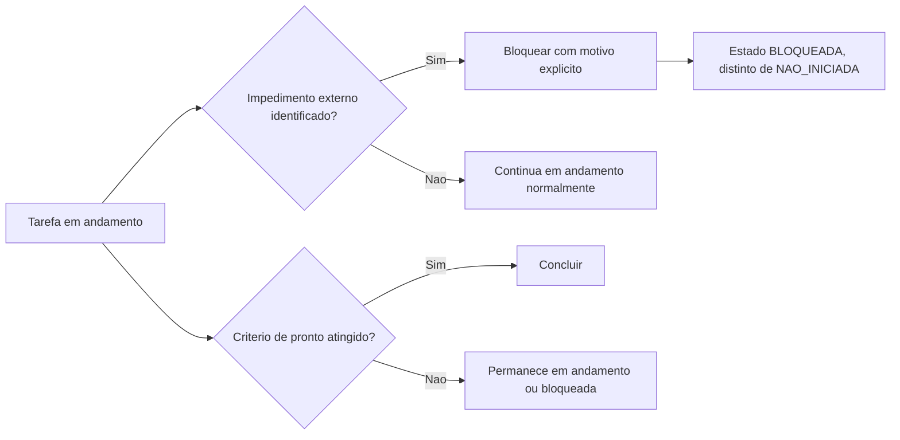

# Fluxogramas

A distinção entre `BLOQUEADA` e `NAO_INICIADA` (nó `E`) existe porque as duas exigem ação
completamente diferente de quem gerencia o plano: uma tarefa não iniciada só precisa que alguém
comece a trabalhar nela; uma tarefa bloqueada precisa que o impedimento externo seja resolvido
antes de qualquer progresso ser possível, frequentemente exigindo escalação a alguém fora da
equipe que executa a tarefa.

## Por que revisão de plano exige motivo declarado

Quando a realidade diverge do plano original — uma tarefa levou muito mais tempo, uma dependência
nova apareceu — a revisão nunca é silenciosa. `registrar_revisao` recusa uma `RevisaoDePlano` sem
motivo, porque um plano revisado sem explicação do porquê perde a mesma rastreabilidade que
qualquer decisão registrada sem contexto perderia — quem olha o histórico depois não consegue
entender se a revisão foi justificada.

A distinção entre os dois fluxos deste documento — estado de tarefa individual (aqui) e revisão
de plano completo (na seção anterior) — reflete que as duas operam em granularidades diferentes:
uma tarefa pode ficar bloqueada sem que o plano inteiro precise ser revisado; uma revisão de plano
pode acontecer sem que nenhuma tarefa individual esteja necessariamente bloqueada no momento.

Reconhecer essa diferença de escopo evita a confusão de tratar um simples bloqueio pontual como se justificasse sozinho uma revisão completa e formal do plano inteiro.