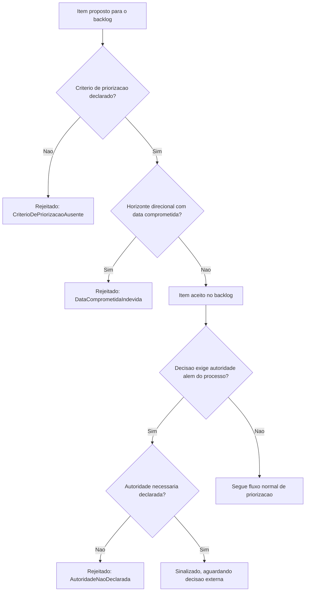

# Diagramas

O nó `D` é a materialização direta de AA5 — um item direcional de longo prazo com data
comprometida nunca passa pela verificação, porque a combinação dos dois campos representa uma
promessa que a própria classificação do item já contradiz.

O ramo de sinalização de autoridade (`G`/`H`/`I`/`J`) nunca decide a questão sozinho — ele apenas
garante que, quando uma decisão está genuinamente fora do escopo do processo de manutenção do
roadmap, essa limitação fica visível e nomeada, em vez de alguém decidir por conta própria só
para o roadmap "parecer completo".

O fluxo inteiro trata backlog como um processo com portões, não como uma lista livre onde
qualquer item entra sem verificação — cada item precisa atravessar critério de priorização e
consistência de horizonte antes de ser considerado parte do roadmap real, não apenas uma ideia
mencionada informalmente em algum lugar.

Cada portão existe para capturar cedo um problema que, se descoberto depois, custaria muito mais para corrigir do que teria custado prevenir na origem.

Esse rigor de portão não torna o processo mais lento na prática — apenas garante que nenhum item
incompleto avance silenciosamente até parecer parte oficial do plano aprovado, preservando a
mesma confiança que qualquer leitor do roadmap deposita nele ao consultá-lo periodicamente.