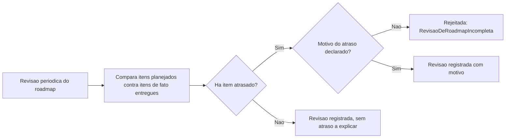

# Fluxogramas

Uma revisão que encontra atraso sem exigir motivo declarado (nó `D`) perderia exatamente a
informação mais útil da revisão — não que algo atrasou, mas por quê, porque o padrão de motivos
ao longo de várias revisões é o que revela se o problema é estimativa mal calibrada, escopo mal
definido, ou dependência externa recorrente.

## Por que dependência entre ciclos é declarada separadamente

Uma dependência entre item de ciclos diferentes — item A deste trimestre depende de entrega do
item B do trimestre anterior — nunca é inferida implicitamente a partir da ordem de aparição no
roadmap. `DependenciaEntreCiclos` exige os três campos (item dependente, item do qual depende,
ciclo de origem) explicitamente, porque a ordem de aparição visual num documento de roadmap é
frequentemente arbitrária e não reflete dependência real entre os itens.

A revisão periódica e a dependência entre ciclos, apesar de aparecerem no mesmo documento, tratam
de aspectos temporais diferentes: uma revisão olha para trás, comparando o que foi planejado
contra o que aconteceu; a dependência entre ciclos olha para frente, declarando explicitamente
que um item futuro só pode avançar depois que outro, de um ciclo anterior, for entregue.

Reconhecer essa diferença de direção temporal evita confundir uma simples atualização retrospectiva com uma declaração formal de dependência futura entre iniciativas distintas.