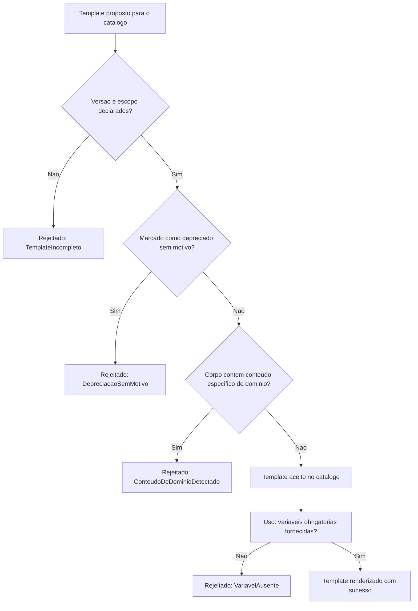

# Fluxogramas

O portão de neutralidade de domínio (`F`) roda contra o mesmo conjunto de palavras que a
verificação de domínio neutro deste acervo já usa em todo volume promovido — a mesma disciplina
aplicada tanto ao conteúdo de prosa de um volume quanto ao corpo de um template catalogado aqui,
sem inventar uma segunda regra paralela para o mesmo problema.

## Por que verificação de variável acontece só no uso, não na criação do template

O template em si (nó `H`) não sabe, no momento de ser catalogado, quais valores serão fornecidos
em cada uso futuro — apenas quais variáveis são obrigatórias. A verificação de completude (`I`)
acontece sempre no momento de `renderizar`, quando os valores reais finalmente existem para
serem comparados contra a lista declarada.

## Relação com a verificação de domínio neutro do acervo

Essa reutilização não é coincidência — a mesma lista de termos proibidos usada pela auditoria de
cada volume promovido (`grep -rli "concilia|controladoria|omie|sicoob"`) é a que este exemplo usa
para verificar o corpo de um template antes de aceitá-lo no catálogo, evitando duas fontes de
verdade divergentes para o mesmo problema de neutralidade.

Manter essa sincronização explícita é o que impede as duas verificações de divergirem silenciosamente conforme o vocabulário proibido evolui com o tempo.

Um vocabulário desatualizado em apenas um dos dois pontos deixaria uma lacuna real de proteção, mesmo que o outro ponto continuasse funcionando corretamente como esperado.